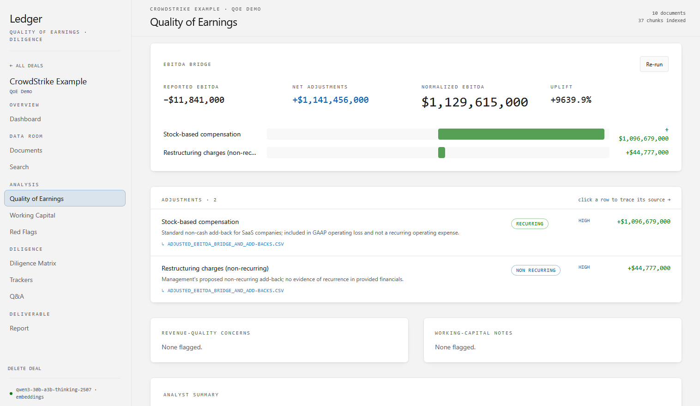
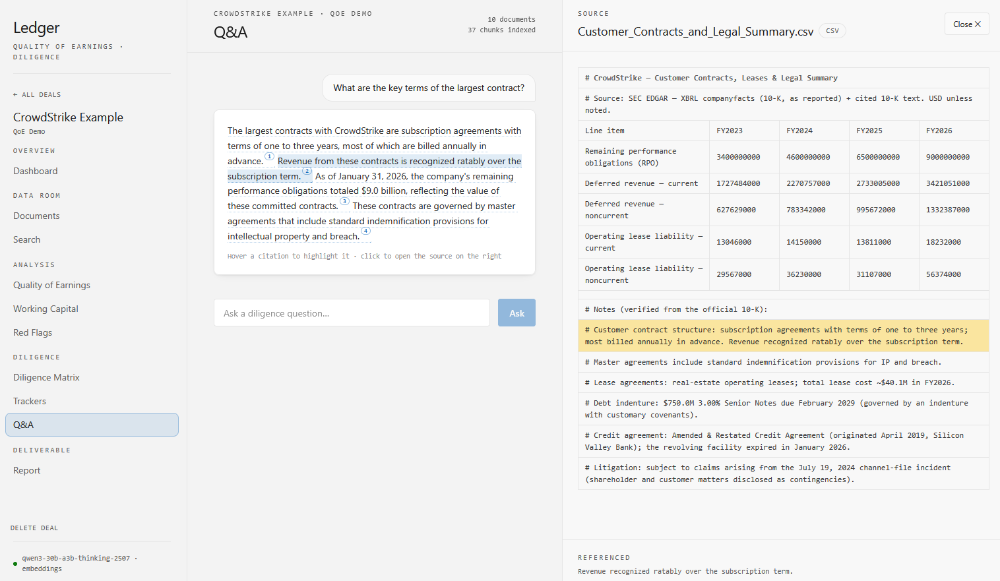
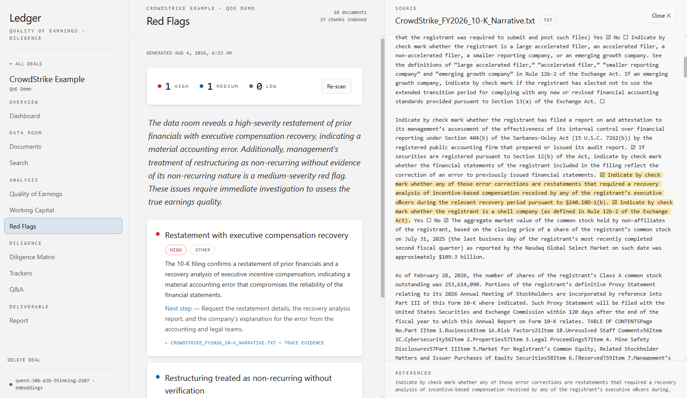

# Ledger: QoE & Diligence Analyzer

A demo AI/RAG app for quality-of-earnings and due-diligence work. Upload a
target company's data room and it produces a normalized-EBITDA bridge,
working-capital and red-flag analysis, cited answers to diligence questions,
and an exportable report.

Two custom systems operate the app: a local-first retrieval engine that
filters a data room down to the evidence worth sending to the LLM, and a
citation engine that ties every claim in an answer back to a verifiable
sentence in the source documents. [How it works](#how-it-works) walks through
both.

## Features

- **Quality of earnings** — reported → normalized EBITDA, with every add-back classified.
- **Working capital & proof of cash** — NWC components, a target peg, and debt-like items.
- **Red flags** — ranked earnings-quality risks, each tied to a quote from the source documents.
- **Diligence matrix** — an editable per-deal question set, answered across all documents at once.
- **Cited Q&A** — every answer links back to the exact sentence it came from.
- **Data room** — PDF, Excel, Word, PowerPoint, CSV, and more; ZIP upload, dedup, search, profiling, readiness scoring, auto-categorization.
- **Report** — print to PDF or export an Excel databook.
- **Any provider** — runs on any OpenAI-compatible endpoint (OpenAI, OpenRouter, Qwen, Bedrock, self-hosted) with one env var. Bring your own token.


*The EBITDA bridge on the CrowdStrike sample: reported to normalized, every add-back classified.*

## Layout

| Path | Purpose |
|---|---|
| `src/qoe/` | FastAPI backend: analysis, retrieval, storage |
| `src/qoe/retrieval.py`, `embeddings.py` | the retrieval engine: local ONNX embeddings, diversity-capped ranking |
| `src/qoe/diligence.py` + `frontend/src/components/SourceViewer.tsx` | the citation engine: enforced at generation, verified at display |
| `src/qoe/llm.py` | provider-agnostic LLM client, schema-constrained output |
| `src/qoe/qoe.py`, `working_capital.py`, `redflags.py` | the analysis passes |
| `src/qoe/ingest.py` | document parsing and chunking |
| `frontend/` | React + Vite dashboard |
| `desktop.py`, `ledger.spec` | desktop EXE launcher and build spec |
| `Dockerfile` | Linux web-app image |
| `eval/` | accuracy benchmark on known-answer accounting problems |
| `samples/` | two demo data rooms built from public SEC filings |

## Requirements

- Git, Python 3.11+, Node 20+ (to build the dashboard)
- An API key for any OpenAI-compatible LLM endpoint

## Build and run

The main target is a single Windows EXE:

```bat
build_exe.bat
```

That builds the dashboard, installs the dependencies, bundles the local
embedding model, and produces `dist_exe\LedgerDiligence.exe` (it takes a few
minutes). Create a `.env` (next section) in `dist_exe\` next to the EXE, then
double-click it.

Other ways to run:

```bash
# Docker (Linux web app)
docker build -t ledger-diligence .
docker run -p 8000:8000 --env-file .env ledger-diligence

# from source
pip install -r requirements.txt
cd frontend && npm install && npm run build && cd ..
python desktop.py
```

## Configuration

```bash
copy .env.example .env        # Windows  (macOS/Linux: cp .env.example .env)
```

Paste your key into `LLM_API_KEY`. Any OpenAI-compatible token works — the app
detects the provider from the token, or set `LLM_PROVIDER` explicitly. The
defaults target a Qwen model on OpenRouter. The `.env` sits next to the EXE
(`dist_exe\`) for the desktop app, or in the project root for Docker and
source runs.

Only the AI analysis and Q&A need a key; upload, search, and profiling work
offline without one.

## Usage

1. Create a deal and upload its documents (or drop in a `.zip`).
2. Run Quality of Earnings, Working Capital, and Red Flags.
3. Ask questions, or run the diligence matrix.
4. Open the Report tab to print a PDF or download the Excel databook.

Citations are clickable: selecting one opens the source document with the
supporting text highlighted.


*Every answer cites its source; selecting the citation highlights the exact sentence.*


*Red flags on the CrowdStrike sample: ranked by severity, each with a concrete next
diligence step and a quote traced back into the filing.*

Two sample data rooms built from real SEC filings (CrowdStrike, Zscaler) ship
in `samples/` — see [samples/README.md](samples/README.md).

## How it works

What follows traces a question end to end: the retrieval engine chooses the
evidence, the citation engine makes the answer checkable, and a thin
orchestration layer holds the rest together.

### The retrieval engine

The large LLM never sees the data room. A small local model filters it first,
and only the survivors are sent out for analysis.

- Ingestion (`ingest.py`) parses eleven file types into chunks. Every chunk
  carries its source filename and a locator (page number, sheet and cell
  range, or paragraph index), so anything retrieved stays traceable to a
  specific place in a specific file. A corrupt file yields zero chunks instead
  of a failed upload.
- Chunks are embedded at upload time with a quantized ONNX model
  (`bge-small`, via fastembed) and stored per deal in SQLite. No embedding
  API is involved: search works offline, and the desktop EXE bundles the
  model.
- A question is embedded once, every chunk is ranked by cosine similarity,
  and the top handful become the LLM's entire context (`retrieval.py`). The
  local model does the filtering; the remote model does the reasoning.
- Raw similarity ranking fails on real data rooms. A prose-heavy filing
  section splits into dozens of chunks that can fill the whole top-k and
  crowd out the financial statements, which parse to one chunk each. So
  retrieval caps results per source file and tops back up by rank when the
  cap leaves slots unfilled.
- With no embedding model available, ranking degrades to keyword overlap
  rather than failing.

### The citation engine

Asking a model to quote its source is not enough: models paraphrase even when
told not to. So citations are enforced at generation time and verified again
at display time.

- At generation, every answer is constrained to a schema (JSON-schema
  response format plus Pydantic validation, with the validation error fed
  back into a retry, `llm.py`). Each citation must contain the claim copied
  verbatim from the answer, the source filename, and a supporting quote from
  that file. If the sources do not contain the answer, the contract requires
  saying so, with no citations.
- At display, selecting a citation opens the source document and hunts for
  the evidence (`SourceViewer.tsx`): a whitespace-tolerant match on the
  quote, then on its first eight words, then on the claim (fast models often
  drop the quote, but the claim was derived from the source, so it overlaps).
  Any hit expands to its enclosing sentence, using sentence boundaries that
  do not split on decimals like $1.5 or 12.3%.
- When nothing matches verbatim, a stopword-filtered word-overlap score picks
  the best sentence, gated by a minimum score: a weak match highlights
  nothing rather than the wrong thing. Spreadsheet citations run the same
  cascade per row, and the header row is excluded from winning.
- The result is that a highlight is evidence, not decoration. What lights up
  is what was actually found in the file.

### Orchestration

- `llm.py` is a provider-agnostic client: the provider is detected from the
  token prefix, presets cover the common endpoints, and Amazon Bedrock has
  its own transport. Two model tiers run over one endpoint by per-call
  override (a reasoning model for the analysis passes, a fast model for
  interactive Q&A). Domain code never imports a vendor SDK.
- Results and citations are stored per deal in SQLite, and an analysis is
  flagged stale when its documents change.
- `eval/run_eval.py` benchmarks the configured model against known-answer
  accounting cases (EBITDA normalization, deferred taxes, lease and revenue
  accounting, working capital); add a case by dropping a JSON file in
  `eval/cases/`.

## Tech Stack

Python · FastAPI · React · Vite · TypeScript · Tailwind · SQLite ·
fastembed/ONNX · PyInstaller · Docker

## License

MIT
